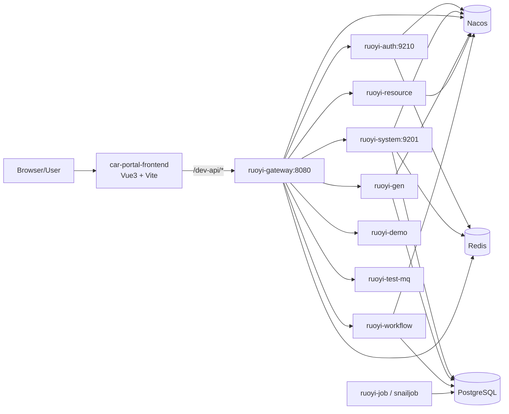
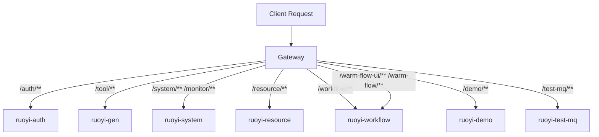
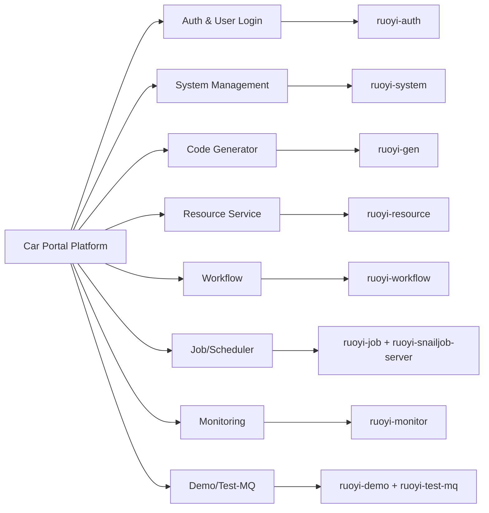
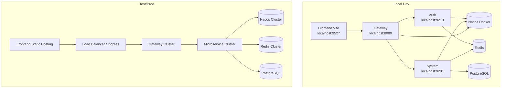

# Car Portal Scaffold Architecture Design

## 1. Document Scope

This document describes the current scaffold architecture in this repository, including:

- Frontend and backend architecture overview
- Request routing
- Functional module map
- Deployment topology (local/test/prod)

## 2. Technology Stack

## 2.1 Frontend

- Vue 3 + TypeScript
- Vite 7
- Pinia
- Vue Router
- Naive UI
- Request proxy via Vite dev server (`/dev-api` -> gateway)

## 2.2 Backend

- Spring Boot 3 + Spring Cloud + Spring Cloud Alibaba
- Nacos (config + service discovery)
- Gateway (WebFlux)
- Multi-service modules (`ruoyi-auth`, `ruoyi-system`, `ruoyi-gen`, `ruoyi-resource`, `ruoyi-workflow`, etc.)
- Redis + PostgreSQL
- Maven multi-module build

## 3. Frontend/Backend Overall Architecture

## 4. Request Routing Design

Routing source: `car-portal-backend/script/config/nacos/ruoyi-gateway.yml`

## 5. Functional Module Map

## 6. Deployment Topology

## 7. Key Runtime Notes

- Nacos namespace must match active profile and startup parameters.
- Gateway is the single entry for frontend API calls.
- Core local bootstrap chain: `ruoyi-system` -> `ruoyi-auth` -> `ruoyi-gateway` -> frontend.
- Current repository includes helper scripts:
  - `scripts/deploy-test.sh`
  - `scripts/deploy-prod.sh`
  - `scripts/stop-services.sh`
