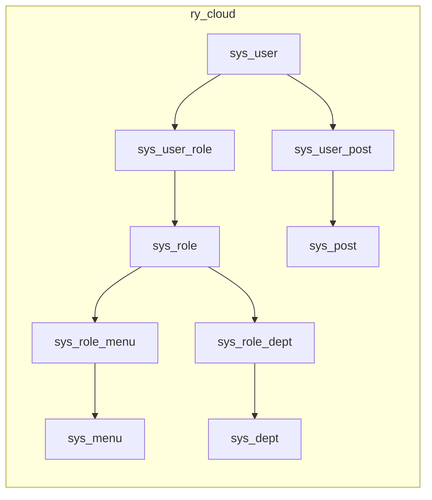
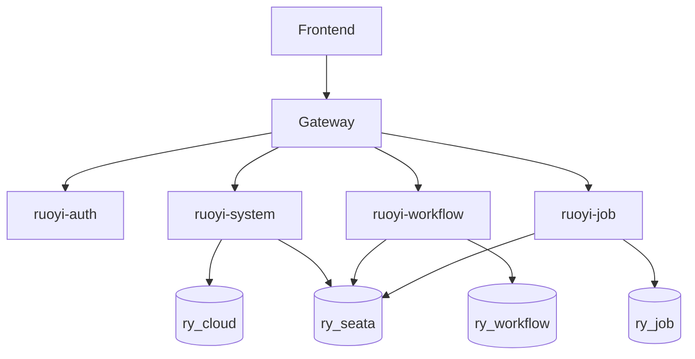

# Car Portal Scaffold Database Design

## 1. Document Scope

This document describes the database design covered by the scaffold SQL scripts under:

- `car-portal-backend/script/sql/postgres/postgres_ry_cloud.sql`
- `car-portal-backend/script/sql/postgres/postgres_ry_job.sql`
- `car-portal-backend/script/sql/postgres/postgres_ry_workflow.sql`
- `car-portal-backend/script/sql/postgres/postgres_ry_seata.sql`

## 2. Data Source Layout

Based on current Nacos datasource config, the scaffold involves these logical databases:

- `ry_cloud` (core business/system)
- `ry_job` (scheduler/retry/job center)
- `ry_workflow` (workflow engine)
- `ry_seata` (distributed transaction metadata)

## 3. ER Overview (Logical)

## 4. Table List by Database

## 4.1 ry_cloud

Core platform/system/business support tables:

- `gen_table`
- `gen_table_column`
- `sys_client`
- `sys_config`
- `sys_dept`
- `sys_dict_data`
- `sys_dict_type`
- `sys_logininfor`
- `sys_menu`
- `sys_notice`
- `sys_oper_log`
- `sys_oss`
- `sys_oss_config`
- `sys_post`
- `sys_role`
- `sys_role_dept`
- `sys_role_menu`
- `sys_social`
- `sys_tenant`
- `sys_tenant_package`
- `sys_user`
- `sys_user_post`
- `sys_user_role`
- `test_demo`
- `test_tree`
- `undo_log`

### Main function groups (ry_cloud)

- Organization & permissions: `sys_user`, `sys_role`, `sys_dept`, `sys_menu`, relation tables
- Dictionary & configuration: `sys_dict_type`, `sys_dict_data`, `sys_config`
- Audit & operation logs: `sys_oper_log`, `sys_logininfor`
- Tenant model: `sys_tenant`, `sys_tenant_package`
- Code generation metadata: `gen_table`, `gen_table_column`
- File/object storage metadata: `sys_oss`, `sys_oss_config`
- OAuth/social/client: `sys_social`, `sys_client`

## 4.2 ry_job

Job and retry framework tables (SnailJob-style model):

- `sj_distributed_lock`
- `sj_group_config`
- `sj_job`
- `sj_job_executor`
- `sj_job_log_message`
- `sj_job_summary`
- `sj_job_task`
- `sj_job_task_batch`
- `sj_namespace`
- `sj_notify_config`
- `sj_notify_recipient`
- `sj_retry`
- `sj_retry_dead_letter`
- `sj_retry_scene_config`
- `sj_retry_summary`
- `sj_retry_task`
- `sj_retry_task_log_message`
- `sj_server_node`
- `sj_system_user`
- `sj_system_user_permission`
- `sj_workflow`
- `sj_workflow_node`
- `sj_workflow_task_batch`

## 4.3 ry_workflow

Workflow engine domain tables:

- `flow_category`
- `flow_definition`
- `flow_his_task`
- `flow_instance`
- `flow_instance_biz_ext`
- `flow_node`
- `flow_skip`
- `flow_spel`
- `flow_task`
- `flow_user`
- `test_leave`
- `undo_log`

### Main function groups (ry_workflow)

- Process modeling: `flow_definition`, `flow_node`, `flow_category`, `flow_spel`
- Runtime instance/task: `flow_instance`, `flow_task`
- History: `flow_his_task`
- Assignment/participant: `flow_user`
- Business extension mapping: `flow_instance_biz_ext`

## 4.4 ry_seata

Distributed transaction metadata tables:

- `branch_table`
- `distributed_lock`
- `global_table`
- `lock_table`
- `vgroup_table`

## 5. Cross-Database Notes

- `undo_log` exists in multiple business databases for transaction rollback support.
- `ry_cloud` stores most management and authorization data.
- `ry_job` and `ry_workflow` are isolated by domain to reduce coupling.
- `ry_seata` is dedicated to distributed transaction coordination metadata.

## 6. Typical Data Access Paths

## 7. Maintenance Recommendations

- Manage schema changes via versioned SQL under `script/sql/update/...`.
- Keep PostgreSQL and Oracle SQL evolution scripts aligned where both are supported.
- For new modules, prefer independent schema/database and explicit ownership boundaries.
